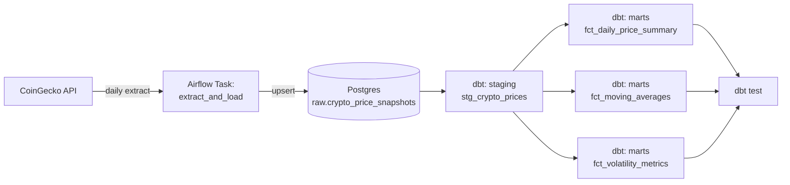

# Crypto Pulse — Airflow + dbt Market Data Pipeline

A daily-scheduled data pipeline that ingests cryptocurrency market data,
lands it in a Postgres warehouse, and transforms it into analytics-ready
tables using dbt — all orchestrated by Apache Airflow and containerized
with Docker.

## Why this project

Rather than a generic sales-CSV pipeline, this project works with live
market data from a public API, which means dealing with real-world
concerns: upserts on daily snapshots, window-function based metrics
(moving averages, rolling volatility), and idempotent re-runs.

## Architecture



**Orchestration:** Airflow (LocalExecutor — no Redis/Celery/Flower, kept
deliberately lean so the whole stack runs on modest hardware).
**Storage:** a single Postgres 15 container, with a separate database
(`crypto_warehouse`) for the analytics data so it's isolated from
Airflow's own metadata DB.
**Transformation:** dbt-postgres, with a `staging` → `marts` layering.

## Project structure

```
crypto_pulse_pipeline/
├── dags/
│   └── crypto_market_pipeline_dag.py   # Airflow DAG: extract → load → dbt run → dbt test
├── include/
│   └── scripts/
│       └── fetch_market_data.py        # CoinGecko API client
├── dbt/
│   └── crypto_analytics/
│       ├── dbt_project.yml
│       ├── profiles.yml
│       └── models/
│           ├── staging/
│           │   ├── stg_crypto_prices.sql
│           │   └── schema.yml
│           └── marts/
│               ├── fct_daily_price_summary.sql
│               ├── fct_moving_averages.sql
│               ├── fct_volatility_metrics.sql
│               └── schema.yml
├── init-db/
│   └── init-warehouse.sh               # Creates the warehouse DB/schemas on first boot
├── docker-compose.yml
├── Dockerfile
└── requirements.txt
```

## What the pipeline does

1. **`create_raw_table`** — ensures the `raw.crypto_price_snapshots` table
   exists (idempotent, safe to run every day).
2. **`extract_and_load`** — calls the CoinGecko `/coins/markets` endpoint
   for the top 25 coins by market cap and upserts one row per coin per
   day (`ON CONFLICT (coin_id, snapshot_date) DO UPDATE`), so re-running
   the same day never creates duplicates.
3. **`dbt_run`** — builds:
   - `stg_crypto_prices` — cleaned/typed view over the raw snapshots
   - `fct_daily_price_summary` — daily price + a simple gain/loss category
   - `fct_moving_averages` — 7-day and 14-day rolling average price
   - `fct_volatility_metrics` — daily returns and 7-day rolling volatility
4. **`dbt_test`** — runs `not_null` tests on key columns to catch bad
   loads before they reach the marts.

Because it's a daily snapshot pipeline, the moving-average and
volatility models get more meaningful the longer the DAG has been
running — after two weeks of daily runs you'll have a full 14-day
trailing window per coin.

## Running it


> Requires Docker and Docker Compose. Needs roughly 3-4 GB of RAM
> available to Docker. If that's tight on your machine, run it on a
> free cloud dev environment instead (GitHub Codespaces, Gitpod, or a
> free-tier cloud VM) rather than locally.

**1. Set your Airflow password**

Copy the example env file and choose your own password:

```bash
cp .env.example .env
```

Then open `.env` and change `AIRFLOW_ADMIN_PASSWORD` to a password of your choice.

**2. Start the stack**

```bash
docker compose up --build
```

**3. Open Airflow**

Go to **http://localhost:8080** and log in with username `admin` and the
password you set in `.env`. Un-pause the `crypto_market_pipeline` DAG, or
trigger it manually for an immediate run.

## Design decisions worth calling out

- **LocalExecutor over CeleryExecutor**: this pipeline has no need for
  distributed workers, so Redis/Celery/Flower would only add memory
  overhead without adding capability.
- **Upsert instead of append-only**: makes the ingestion task safely
  re-runnable (important for backfills and manual re-triggers).
- **Window functions computed in dbt, not in the ingestion script**:
  keeps the extraction layer dumb and stateless, and lets the
  transformation logic live in version-controlled SQL that's easy to
  test and extend.

## Possible extensions

- Add a Slack/email alert on `dbt_test` failure.
- Add an `dim_coins` dimension table with static metadata (category,
  launch date, etc.).
- Swap the moving-average window from calendar days to a
  `dbt_utils.date_spine`-backed grid to handle missing days gracefully.
- Add a lightweight BI layer (Metabase/Streamlit) on top of the marts.
